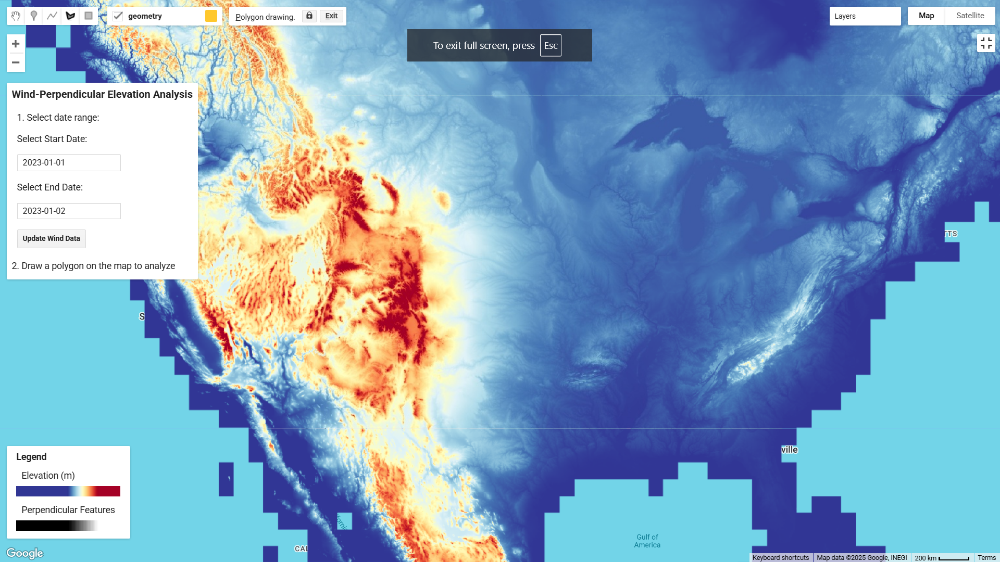

# Agroforestry Windbreak System

## Description
This project is a **Google Earth Engine (GEE)** application designed to visualize wind patterns and elevation data for agroforestry windbreak planning. Users can select a date range, draw a polygon, and analyze wind direction and elevation in the selected area.

## Deployment
The system is deployed on **Google Earth Engine** using its built-in Code Editor. Users can access it by copying and running the script in the GEE environment.

## Access
1. Sign in to [Google Earth Engine](https://code.earthengine.google.com/).
2. Copy and paste the script into the Code Editor.
3. Run the script and interact with the UI.

## Technology & Data Used
- **Google Earth Engine (GEE)** for geospatial analysis.
- **SRTM DEM** (USGS/SRTMGL1_003) for elevation data.
- **ECMWF ERA5-LAND HOURLY** for wind direction data.
- **JavaScript** for scripting the application.

